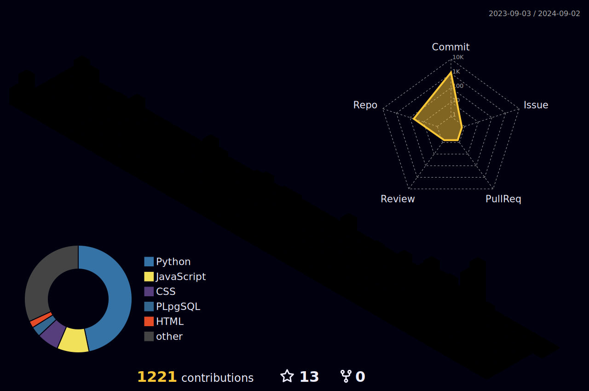

### Hi 👋, I'm Javier
[SPANISH](./README.md) 

 

- 🔭 FullStack Developer.
- 🔭 I am freelancing in web development and SEO/SEM.
- 🌱 I am currently developing Google Cloud Skills Boost online labs, you can see my badges at: Badges .
- 💬 SEO Specialist (Search Engine Optimization in Google, bing, etc).

### ✍️ Dev Quote of the Day

## TI:

 

 

 

 

 

 
And some more...

